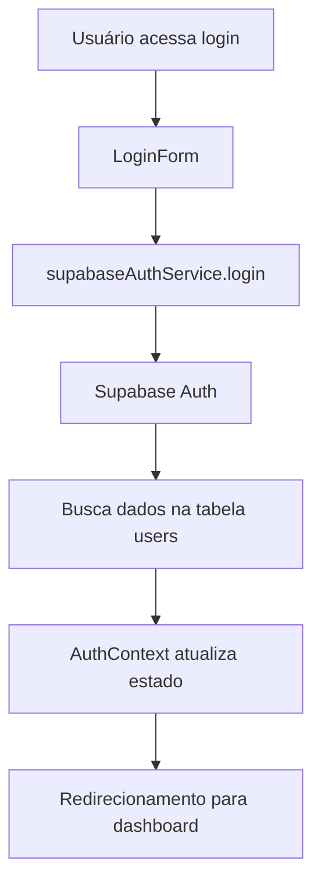

# 🔐 Configuração da Autenticação - Sistema V01

Este guia explica como configurar e usar o sistema de autenticação baseado no Supabase.

## 📋 Pré-requisitos

1. **Projeto Supabase criado**
2. **Variáveis de ambiente configuradas**
3. **Banco de dados migrado**

## 🚀 Configuração Inicial

### 1. Configurar Variáveis de Ambiente

Copie o arquivo de exemplo e configure suas credenciais:

```bash
cp env.example .env
```

Edite o arquivo `.env` com suas credenciais do Supabase:

```env
# Configurações do Supabase
VITE_SUPABASE_URL=https://seu-projeto.supabase.co
VITE_SUPABASE_ANON_KEY=sua_chave_anonima_aqui
SUPABASE_SERVICE_ROLE_KEY=sua_chave_de_servico_aqui
```

### 2. Executar Migrações

```bash
# Se usando Supabase CLI
supabase db push

# Ou execute as migrações manualmente no dashboard do Supabase
```

### 3. Criar Usuários de Teste

```bash
npm run auth:create-users
```

Este comando criará os seguintes usuários de teste:

| Email | Senha | Role |
|-------|-------|------|
| admin@exemplo.com | senha123 | ADMIN |
| manager@exemplo.com | senha123 | MANAGER |
| agent@exemplo.com | senha123 | AGENT |
| user@exemplo.com | senha123 | USER |
| support@exemplo.com | senha123 | SUPPORT |

### 4. Testar Autenticação

```bash
npm run auth:test
```

## 🏗️ Arquitetura do Sistema

### Componentes Principais

1. **`supabaseAuthService.ts`** - Serviço principal de autenticação
2. **`AuthContext.tsx`** - Contexto React para gerenciar estado
3. **`LoginForm.tsx`** - Formulário de login
4. **`ProtectedRoute.tsx`** - Proteção de rotas

### Fluxo de Autenticação



## 🔧 Uso no Código

### Proteger Rotas

```tsx
import { ProtectedRoute } from '@/components/auth/ProtectedRoute';

// Rota protegida para qualquer usuário autenticado
<ProtectedRoute>
  <Dashboard />
</ProtectedRoute>

// Rota protegida para roles específicos
<ProtectedRoute roles={['ADMIN', 'MANAGER']}>
  <AdminPanel />
</ProtectedRoute>
```

### Usar Autenticação em Componentes

```tsx
import { useAuth } from '@/contexts/AuthContext';

const MyComponent = () => {
  const { user, login, logout, isAuthenticated } = useAuth();

  if (!isAuthenticated) {
    return <div>Faça login para continuar</div>;
  }

  return (
    <div>
      <h1>Bem-vindo, {user?.name}!</h1>
      <p>Seu role: {user?.role}</p>
      <button onClick={logout}>Sair</button>
    </div>
  );
};
```

## 🛠️ Troubleshooting

### Problema: "Credenciais inválidas"

**Possíveis causas:**
1. Usuário não existe no Supabase Auth
2. Usuário não existe na tabela `users`
3. Senha incorreta

**Solução:**
```bash
# Recriar usuários de teste
npm run auth:create-users

# Testar autenticação
npm run auth:test
```

### Problema: "Usuário não encontrado no sistema"

**Causa:** Usuário existe no Supabase Auth mas não na tabela `users`

**Solução:**
1. Verificar se as migrações foram executadas
2. Verificar se o usuário foi criado na tabela `users`
3. Recriar o usuário com o script

### Problema: Erro de conexão com Supabase

**Possíveis causas:**
1. URL do Supabase incorreta
2. Chave anônima incorreta
3. Projeto Supabase pausado

**Solução:**
1. Verificar variáveis de ambiente
2. Verificar status do projeto no dashboard do Supabase
3. Testar conexão com `npm run auth:test`

## 📊 Monitoramento

### Logs de Autenticação

O sistema registra automaticamente:
- Tentativas de login (sucesso/falha)
- Logouts
- Erros de autenticação
- Renovação de tokens

### Dashboard do Supabase

Acesse o dashboard do Supabase para monitorar:
- Usuários ativos
- Sessões
- Logs de autenticação
- Métricas de uso

## 🔒 Segurança

### Boas Práticas Implementadas

1. **Row Level Security (RLS)** habilitado
2. **Tokens JWT** com expiração automática
3. **Refresh tokens** para renovação automática
4. **Validação de roles** em rotas protegidas
5. **Sanitização de dados** de entrada

### Configurações de Segurança

```env
# Timeout de sessão (30 minutos)
VITE_SESSION_TIMEOUT=1800000

# Máximo de tentativas de login
VITE_MAX_LOGIN_ATTEMPTS=5

# Habilitar 2FA (futuro)
VITE_ENABLE_2FA=false
```

## 🚀 Próximos Passos

1. **Implementar 2FA** (Autenticação de dois fatores)
2. **Adicionar recuperação de senha**
3. **Implementar logout automático por inatividade**
4. **Adicionar auditoria de login**
5. **Implementar roles dinâmicos**

## 📞 Suporte

Se encontrar problemas:

1. Verifique os logs do console
2. Execute `npm run auth:test`
3. Verifique o dashboard do Supabase
4. Consulte a documentação do Supabase Auth

---

**Última atualização:** Janeiro 2025
